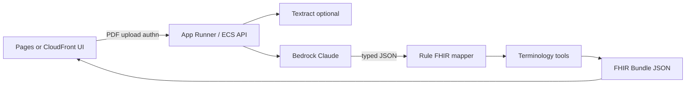

# PDF2FHIR deployment options

> **NOT FOR CLINICAL USE.** Educational / SIM prototype only. Do not use outputs for diagnosis, treatment, billing, or clinical decision support. Prefer **de-identified** PDFs in any AWS tenant until compliance review.

This note is for moving beyond the V0 GitHub Pages demo into an **AWS tenant** (including a **Claude Code** session) where a real LLM processes real clinical PDFs.

Live demo: https://alltomstales-dotcom.github.io/pdf2fhir/

---

## What V0 is today

| Piece | Behavior |
|-------|----------|
| Hosting | Static **Vite** app on **GitHub Pages** (`base: /pdf2fhir/`) |
| PDF | Browser **pdf.js** text extract (no OCR for scans) |
| LLM | **Demo stub** (no key) or **Live** OpenAI-compatible `POST {base}/chat/completions` |
| Secrets | `VITE_LLM_*` placeholders + **localStorage** overrides (key never committed) |
| FHIR | Client-side map → R4 `Bundle` (`Patient`, `Encounter`, `Condition`, `Observation`, `MedicationRequest`) + light terminology flags |

**Good for:** FDE demos, stub walkthroughs, pointing Live mode at a non-PHI OpenAI-compatible endpoint.

**Not enough for real PDFs with PHI:** browser-held API keys, no OCR, no server-side audit, no deterministic FHIR gate, weak coding.

---

## Target shape for real PDFs (V1)

Align with the locked OSS references:

1. **Google Medical Data Toolkit** — LLM → **typed JSON** → **deterministic** FHIR mapper (not free-form Bundle JSON from the model)
2. **FHIR-XTract** — upload UX + OCR path + **HL7 Validator** gate
3. **Infherno** — **terminology-as-tool** (ICD-10 / LOINC / SNOMED) instead of post-hoc string flags only

```text
[PDF / scan]
    → OCR (Textract or Tesseract) when needed
    → LLM extract → typed ClinicalExtract JSON
    → rule-based FHIR R4 mapper (US Core–leaning)
    → terminology tools (ICD-10 / LOINC / SNOMED) + confidence
    → optional HL7 Validator
    → Bundle JSON (+ DocumentReference pointer to source PDF)
```

---

## Option A — Keep Pages UI, point Live at an AWS OpenAI-compatible gateway *(fastest)*

**Idea:** Leave the static demo on Pages. Run a small **OpenAI-compatible** proxy in AWS that Claude Code / Bedrock / a self-hosted model can back. In the demo Settings panel, set:

- Base URL → `https://<your-api>.example.com/v1`
- Model → your Bedrock/Claude/proxy model id
- API key → gateway key (still browser-visible in V0 — **do not use PHI**)

**AWS building blocks:**

- API Gateway (HTTP) → Lambda or ECS/Fargate service that implements `/v1/chat/completions`
- Or **LiteLLM** / similar proxy on ECS/App Runner fronting **Amazon Bedrock** (Claude)
- Secrets Manager / SSM for model credentials (never `VITE_*` for production)

| Pros | Cons |
|------|------|
| Minimal UI change; good Claude Code spike | Keys still in browser if you keep V0 as-is |
| Reuses existing Live path | No OCR; PHI still processed client-side |

**Use when:** Validating prompts/models on **de-identified** text PDFs before building a backend.

---

## Option B — App Runner / ECS Fargate backend *(recommended for Claude Code in-tenant)*

**Idea:** Claude Code iterates a small Python/Node service in the AWS account:

1. `POST /convert` — multipart PDF upload
2. Text extract (+ **Textract** if scanned)
3. Call Bedrock/Claude (IAM role, no browser key)
4. Emit typed JSON → deterministic FHIR map
5. Return Bundle + coding report

Keep Pages (or CloudFront) as UI that calls the API (CORS + Cognito/IAM auth later).

| Pros | Cons |
|------|------|
| Secrets stay server-side; auditable | More moving parts than Pages-only |
| Natural Claude Code working tree | Need auth before any PHI |
| Matches Google MDT pipeline split | OCR + coding spikes required |

**Suggested Claude Code kickoff (in tenant):**

```text
Repo goal: PDF2FHIR V1 API next to the V0 Vite demo.
- Implement POST /convert (PDF → ClinicalExtract JSON → FHIR R4 Bundle)
- Use Bedrock Claude via IAM; OpenAI-compatible shim optional for local
- Add Textract path when pdf text is empty
- Map resources US Core–leaning; flag uncoded concepts
- Do NOT ask the LLM to invent full Bundle JSON long-term
- De-identified sample PDFs only until compliance sign-off
```

---

## Option C — Serverless S3 → BDA/Textract → Lambda → FHIR *(scale / batch)*

**Idea:** Drop PDFs in S3; event triggers extraction (Bedrock Data Automation and/or Textract + Comprehend Medical coding helpers); Lambda maps to FHIR R4; write Bundle/NDJSON to S3 or **HealthLake**.

Reference pattern (conceptual): [AWS BDA → FHIR sample](https://github.com/aws-samples/sample-bedrock-data-automation-fhir-pipeline)

| Pros | Cons |
|------|------|
| Scales; good for archives | Heavier for interactive FDE demo |
| Confidence scores on fields | AWS lock-in; blueprint maintenance |

**Use when:** Batch digitization after Option B prompt/mapper is proven.

---

## Option D — Dev box only (EC2 / Cloud9 / SSM Session Manager)

**Idea:** Claude Code on a locked-down EC2 in a private subnet with repo clone, sample PDFs in an encrypted volume, Bedrock access via instance role. No public UI until Option B ships.

| Pros | Cons |
|------|------|
| Fastest path to “real PDF + real model” experiments | Not a deployable product by itself |
| Easy IAM boundary | Must enforce de-id + no exfil |

---

## Recommendation for Thomas’s next session

| Priority | Choice |
|----------|--------|
| **Start** | **Option D** (Claude Code on AWS box) to harden extract→JSON→FHIR on de-identified PDFs |
| **Ship interactive** | Promote to **Option B** (App Runner/ECS) with IAM Bedrock + Textract |
| **Optional bridge** | **Option A** only for non-PHI prompt tests against the existing Pages UI |
| **Later** | **Option C** for batch / HealthLake |

Do **not** put PHI API keys in `VITE_LLM_API_KEY` or localStorage for anything beyond synthetic demos.

---

## Environment & secrets

| Context | Do |
|---------|----|
| V0 Pages demo | Empty key = stub; optional personal key for non-PHI Live tests |
| AWS V1 API | Bedrock via **IAM role**; Secrets Manager only if calling external OpenAI-compatible hosts |
| Claude Code | Inject tenant credentials via env/IAM — never commit `.env` with real keys |

V0 placeholders (browser only):

```bash
VITE_LLM_API_KEY=
VITE_LLM_BASE_URL=https://api.openai.com/v1
VITE_LLM_MODEL=gpt-4o-mini
```

---

## V1 spike checklist (Claude Code)

- [ ] Server `POST /convert` accepting PDF bytes
- [ ] pdf text extract + **OCR fallback** (Textract or Tesseract)
- [ ] LLM → **typed** extract schema (conditions, meds, labs, vitals)
- [ ] Deterministic FHIR R4 mapper (US Core–leaning profiles)
- [ ] Terminology tools: ICD-10-CM / LOINC / SNOMED (confidence + uncoded)
- [ ] Optional HL7 Validator gate
- [ ] `DocumentReference` (or Binary) for source PDF pointer
- [ ] Structured logging; no PHI in client bundles for public Pages
- [ ] Explicit **NOT FOR CLINICAL USE** on API responses

---

## Architecture (recommended V1)



---

## OSS references

| Ref | Why |
|-----|-----|
| [Google Medical Data Toolkit](https://github.com/Google-Health/medical-data-toolkit) | LLM → JSON → rule FHIR |
| [FHIR-XTract](https://github.com/KIET7UKE/FHIR-XTract) | Upload + OCR + validator UX |
| [Infherno](https://github.com/j-frei/Infherno) | Terminology-as-tool during generation |

---

## License / warranty

MIT demo software. **No clinical warranty.** Aggregate or de-identify. Map geography or org names used in sibling demos are SIM-labeled and unrelated to production eligibility.
